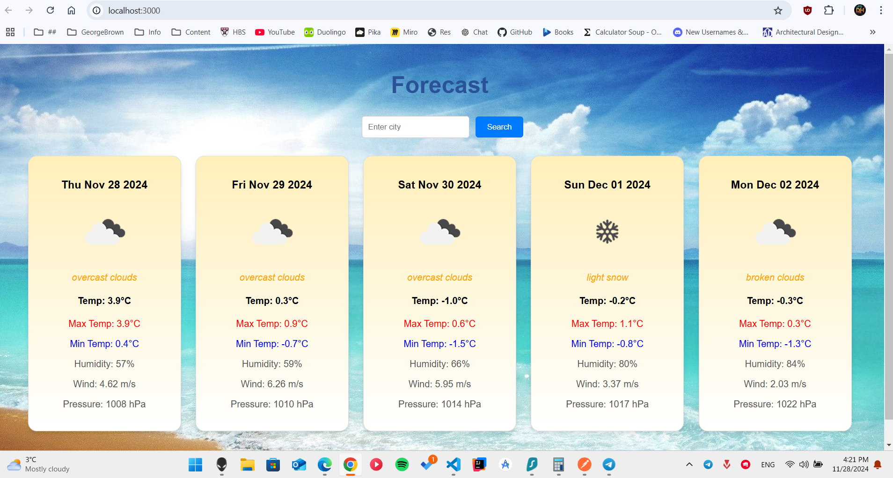

# DIEGO TSUKAYAMA

# COMP 3123 LAB TEST 2 - WEATHER APP USING REACTJS

## Explanations

- apiService.js

  - This file is in charge of making the calls to the OpenWeatherMap to get the data for the weather forecast.
  - The api was hardcoded in case it's supposed to be tested by the evaluator.

- ForecastDisplay.js
  - This is the component that has all the weather information displayed in the application. It has functionality that goes through all the data and shows a card for each of the days in the forecast.
  - Made custom design so that the data is easier to view and understand.

## Screenshots

